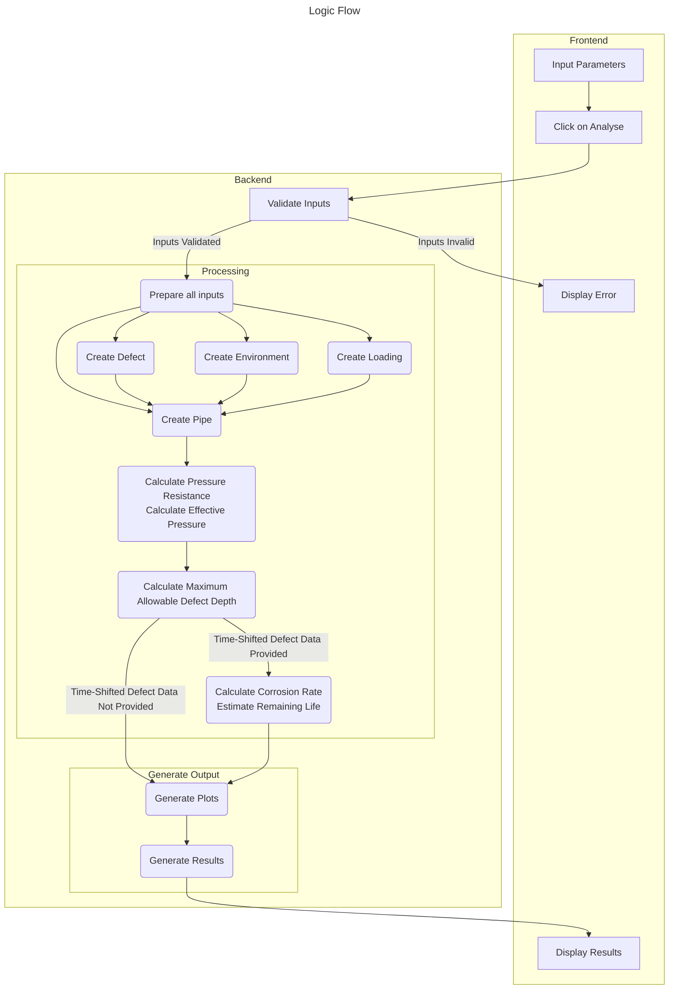
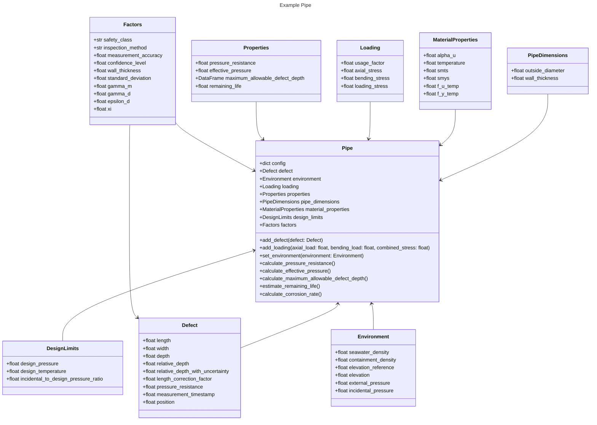

# corrosion-analyser
Analyse corroded pipelines and assess the integrity and remaining life as per [DNV-RP-F101](https://www.dnv.com/oilgas/download/dnv-rp-f101-corroded-pipelines.html).

Corrosion analyser is a web application that allows users to quickly analyse the integrity of corroded pipelines. The application is built using [Dash](https://dash.plotly.com/).

|                               Desktop Web UI                               |                              Mobile Web UI                               |
|:--------------------------------------------------------------------------:|:------------------------------------------------------------------------:|
|  |  |

## Features
- Analyse corroded pipelines
- Assess the integrity and remaining life of corroded pipelines
- Graphically visualise computed results


## Usage
1. Input the pipeline details
2. Input the corrosion details
3. Click the "Calculate" button to get the results
4. The results will be displayed below the input form

## Deploy
The application can be accessed [here](https://corrosion-analyser.onrender.com/).

### Local Development
1. Clone the repository and navigate to the project directory
2. Install Python 3.11
3. Install [Poetry](https://python-poetry.org/docs/#installing-with-the-official-installer)
4. Install the dependencies using `poetry install`
5. Run the application using `poetry run python -m src.app`
6. Open the browser and navigate to [http://localhost:8050](http://localhost:8050)

### Run with Docker
```shell
docker run --name corrosion-analyser -p 8050:8050 nicholaslimck/corrosion-analyser
```

After the container is deployed, open the browser and navigate to [http://localhost:8050](http://localhost:8050)

### Run with Docker Compose
Download docker-compose.yml into your local machine:
```shell
curl https://raw.githubusercontent.com/nicholaslimck/corrosion-analyser/main/docker-compose.yml > docker-compose.yml
```

Run the app using docker compose:
```shell
docker compose up
```

After the container is deployed, open the browser and navigate to [http://localhost:8050](http://localhost:8050)

## Project Structure
### Logic Flow

### Class Structure
